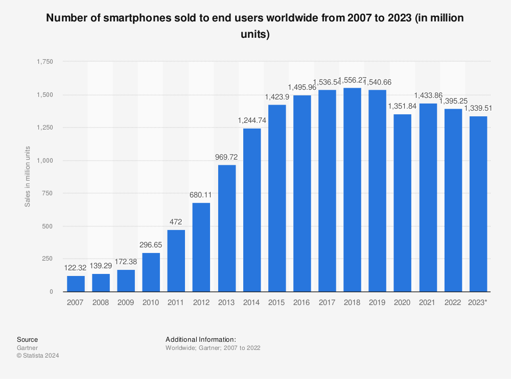

# Sustainability Assessment of Smartphones

---

##### Personal Motivation

I've always been fascinated by Electronics and Technology, enjoying tinkering with circuits, microcontrollers, and smartphones. I've built projects aimed at reusing parts from old devices, like phones, but encountered challenges such as safety issues and the planned obsolescence of part design hinders my ability to fully use these parts. These experiences have made me more aware of the environmental impact of electronic devices and particularly the waste they generate.

##### Why Smartphones?
Smartphones, boasting 4.3 billion users worldwide, remain in high demand with no signs of slowing down. However, their average lifespan of 2.5 years, coupled with annual releases of new models, results in a substantial number of smartphones being discarded annually. This contributes significantly to the ever-growing electronic waste stream, highlighting the urgent need for sustainable solutions in device production and disposal. Acknowledging the large scope and intricacies inherent in conducting as sustainability assessment for smartphones, I've decided to narrow my focus exclusively to the examination of smartphone batteries. 
<!-- (https://www.statista.com/statistics/330695/number-of-smartphone-users-worldwide/) -->

  

    <h5>Why SmartPhone Batteries</h5>
    
Focusing on smartphone batteries for my sustainability assessment will provide insights into their environmental, social, and economic impacts. Batteries, crucial for smartphone functionality, involve resource-intensive production, potentially leading to habitat destruction and carbon emissions. Addressing resource depletion, toxicity, and pollution issues, as well as improving end-of-life management such as battery reuse and recycle, are essential considerations. Evaluation also drives innovation towards more sustainable energy storage solutions.

  

  

  

---

#### Possible Scope

#### Possible Sustainability Factors
##### Economic
Electronic waste results in a staggering annual economic loss exceeding £45 billion due to the inefficient disposal of critical raw materials like iron, copper, and gold.
The disposal of spent batteries contributes to significant economic losses, as valuable materials such as lithium, cobalt, and nickel are not effectively recovered and reused.
Inefficient battery recycling processes result in missed opportunities for resource recovery, impacting the availability and cost of critical raw materials in the market.

##### Environmental
The improper disposal of electronic waste contributes significantly to the creation of vast landfills, exacerbating environmental challenges which vary by region.
Improper disposal of batteries contributes to environmental degradation, as toxic chemicals and heavy metals leach into soil and groundwater, posing risks to ecosystems and human health.
Battery production processes, including mining and manufacturing, contribute to habitat destruction, deforestation, and carbon emissions.

##### Social
The social consequences of electronic waste extend to those working in mines and landfills, facing health hazards.
It is crucial to address the human impact of improper e-waste management, ensuring the protection of workers' rights and health.

---

#### Types of Batteries

##### Lithium-ion (Li-ion) Batteries:

Lithium-ion batteries are the most common type used in smartphones due to their high energy density, lightweight design, and relatively low self-discharge rate. They offer excellent performance and can be recharged multiple times.

 
 

##### Lithium Polymer (LiPo) Batteries:

Lithium polymer batteries are a variation of lithium-ion batteries with a different electrolyte composition. They are more flexible in shape and size, allowing for thinner and lighter designs in smartphones. LiPo batteries are commonly used in modern smartphones due to their versatility and improved safety features.

 
 

##### Solid-State Batteries:

Solid-state batteries are an emerging technology that promises improved safety, energy density, and longevity compared to traditional lithium-ion batteries. While not yet widely used in smartphones, solid-state batteries hold potential for future advancements in mobile device battery technology.

--- 

#### Possible Sustainability Indicators

##### Environmental Indicators:
Resource Depletion: Assess the impact of raw material extraction for battery production, focusing on the depletion of non-renewable resources such as lithium, cobalt, and nickel.\
Toxicity and Pollution: Assess the environmental hazards associated with battery production, including the release of hazardous chemicals and heavy metals during manufacturing and disposal.

##### Social Indicators:

Labour Conditions: Evaluate working conditions and labor rights of workers involved in battery production, particularly in mining and manufacturing facilities, to ensure fair wages, safe working conditions, and adherence to labor standards.\
Human Rights: Ensure that battery production respects human rights principles such as access to clean water, and protection of cultural heritage.

##### Economic Indicators:

Cost of Production: Analyse the cost structure of battery manufacturing, considering factors such as raw material prices, labor costs, and capital investments.\
Economic Viability: Assess the long-term economic viability of battery technologies, considering factors such as scalability, investment risk, and market demand for sustainable energy storage solutions.

##### Technological Indicators:

Efficiency and Performance: Evaluate energy density, cycle life, and charging efficiency of battery technologies.

<!-- Circular Economy Potential: Assess the potential for circular economy principles in battery design, production, and end-of-life management, focusing on opportunities for reuse, remanufacturing, and recycling. -->
<!-- To calculate the carbon footprint, for instance, you need to multiply the energy used to charge the battery by the emission factor of the electricity source. -->